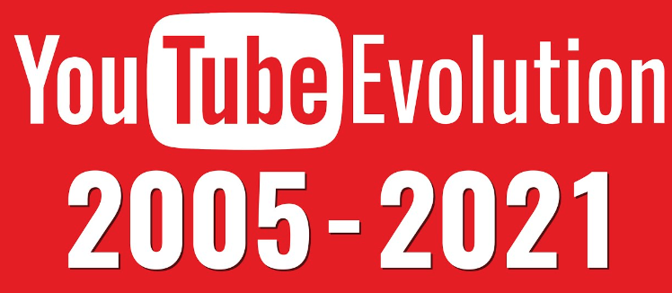

# From Hobby to Profession: The Evolution of YouTube as a Career Platform



## Abstract

Since its inception in 2005, YouTube has transformed from a casual video-sharing site into
a professional platform supporting countless full-time creators. This project investigates
YouTube’s evolution by examining how the average size of successful channels (measured in
subscribers and views) has changed over time. Using channel metadata and time-series data,
we analyze key indicators of professionalization, such as increased upload frequency, content
consistency, and strategic engagement practices. Additionally, we explore which content categories
(e.g., Gaming, Education) have driven the platform’s growth by tracking shifts in production quality,
audience reach, and upload patterns in the video metadata. Through this lens, we map out YouTube’s
transition into a viable career platform and highlight the broader industry trends that support
the professionalization of digital content creation.

## 🔍 Research Questions
1. How has content creation frequency and consistency evolved across different channel categories?
2. Which categories led YouTube's professionalization, and how did professional practices spread?
3. How has creator content strategy evolved to reflect professional monetization approaches?
4. How can content creators enhance their community management from casual to professional engagement?

## 🛠️ Installation & Setup

### Prerequisites
- Python 3.7+
- Git

### Getting Started
```bash
# Clone repository
git clone <project link>
cd <project repo>

# Install dependencies
pip install -r pip_requirements.txt
```

### Dataset Setup
Download the dataset from [Zenodo](https://zenodo.org/records/4650046) and place it in the `/data` folder.

Please download the additional datasets from [additional_datasets](https://drive.google.com/drive/folders/1q0pH2XHFk28kmkeQODJGFlvE8cmRkBDj?usp=drive_link) and place these files in a folder `data/` directory before running the analysis

## 📁 Project Structure
```
project_root/
├── data/                      # Data directory
├── src/                       # Source code
│   ├── data/                 # Data processing modules
│   ├── notebooks/           # Jupyter notebooks
│   ├── scripts/             # Utility scripts
│   └── utils/               # Helper functions
├── results.ipynb             # Main results notebook
├── .gitignore               # Git ignore file
├── pip_requirements.txt     # Python dependencies
└── README.md                # Project documentation
```

## 🔧 Methods & Analysis

### 1. Content Creation Evolution
Analyzing how content creation frequency and consistency have evolved across different YouTube channel categories.

#### Datasets
- `yt_metada_helper.feather`: ~73M videos metadata (2005-2019) from ~137k channels
- `df_channels_en.tsv.gz`: Channel statistics and rankings

#### Methodology
1. **Trend Analysis**
   - Aggregated video uploads per year/category
   - Generated line plots for upload frequency evolution (2006-2018)

2. **Consistency Analysis**
   - Defined active months (≥2 video uploads)
   - Calculated channel-level and category-level consistency metrics
   - Generated time-series visualizations

3. **Distribution Analysis**
   - Analyzed channel contributions to total uploads/views
   - Created cumulative distribution plots

4. **Correlation Analysis**
   - Computed correlations between engagement metrics
   - Visualized using heatmaps

### 2. Content Professionalization
Examining which categories drive YouTube's professionalization and their evolution.

#### Datasets
- `yt_metadata_en.jsonl.gz`: ~14GB video metadata
- `df_channels_en.tsv.gz`: 136,470 English-speaking channels
- `youtube_monetization_api.csv`: Monetization indicators

#### Methodology
1. **Category Distribution Analysis**
   - Aggregated category frequencies
   - Implemented consistent color mapping
   - Calculated category representation percentages

2. **Temporal Evolution Analysis**
   - Created time series for professionalization markers
   - Applied 30-day rolling means
   - Analyzed patterns by category

3. **Cross-Analysis**
   - Implemented weighted linear regression
   - Calculated correlation coefficients
   - Conducted statistical significance testing

### 3. Monetization Strategy Evolution
Analyzing how creator strategies adapted to professional monetization approaches.

#### Datasets
- `df_timeseries_en.tsv.gz`: Time series metrics
- Channel metadata with monetization information

#### Methodology
1. **Production Analysis**
   - Compared weekly video production (52 weeks before/after monetization)
   - Tracked average weekly changes with confidence intervals

2. **Content Analysis**
   - Analyzed video duration changes
   - Tracked subscriber-to-view ratio evolution
   - Compared different monetization strategies

### 4. Community Management Evolution
Analyzing the evolution from casual interaction to professional engagement strategies.

#### Datasets
- `youtube_comments.tsv.gz`: ~8.6B comments
- `yt_metadata_en.jsonl.gz`: Video metadata

#### Methodology
1. **Data Processing**
   - Filtered authors (>100 comments)
   - Created category-comment matrix A where A[i,j] represents comments by author i in category j
   - Normalized each row i by its L1 norm:
     $A_i \leftarrow A_i/||A_i||_{l_1}$

2. **Distance Analysis**
   - Established distance between categories i and j using:
     $dist(cat_i,cat_j)=1-\frac{A_{:i}\cdot A_{j:}}{||A_{:i}||||A_{:j}||}$
   - Similarity metric = 1 - distance
   - Created category clusters using hierarchical clustering with Ward metric

3. **Visualization**
   - Generated heatmap animations
   - Created network visualizations
   - Produced hierarchical dendrograms

## Technical Notes
- Chunk size recommendations for processing:
  - 8GB RAM: 10,000-20,000 rows
  - 16GB RAM: 20,000-40,000 rows
  - 32GB RAM: 40,000-80,000 rows


## 📊 Additional Datasets
The YouNiverse database, while extensive, lacks crucial economic data that's essential for understanding creator professionalization. To address this gap, we augmented the dataset with monetization indicators obtained through the YouTube API. This additional dataset includes three key monetization columns:
- has_affiliate: Indicates affiliation with third-party companies
- has_sponsorships: Shows content sponsored by companies/brands in exchange for product promotion
- has_merchandise: Reflects use of merchant platforms for selling branded goods to fans

To complement this API data, we conducted additional analysis of revenue streams by extracting monetization indicators from video descriptions in the yt_metadata_en.jsonl.gz dataset. Our keyword detection system identified five distinct monetization categories:
- Membership : "subscription," "member," "join button," "channel member," "membership," "premium content"
- Crowdfunding : "patreon," "ko-fi," "donation," "support us," "buy me a coffee," "gofundme," "paypal," "tip jar," "patron"
- Merchandise : "merchandise," "merch," "shop," "store," "tshirt," "t-shirt," "hoodie," "apparel," "limited edition"
- Sponsorship : "sponsor," "sponsored," "partnership," "partner," "paid promotion," "#ad," "#sponsored," "promotion"
- Affiliate Marketing : "affiliate," "amazon link," "discount code," "promo code," "referral," "use code," "commission"

## 🌐 Web Presence
Explore our complete data story on our [website](https://webpanada.vercel.app/).

## 👥 Team & Responsibilities
- **Imane**: Website development, data story creation
- **Koami**: Research question 2 analysis, monetization data integration
- **Antoine**: Problem formulation, research question 1 analysis
- **Adam**: Community management analysis
- **Valentine**: Content strategy evolution analysis

## 📅 Timeline
## Project Timeline

| Phase | Task | Start Date | End Date | Status |
|:------|:-----|:-----------|:---------|:------:|
| **Data Preparation** | Data Cleaning & Initial EDA | Nov 15, 2024 | Dec 04, 2024 | ✅ |
| **Analysis** | Core Analysis Implementation | Dec 04, 2024 | Dec 10, 2024 | ✅ |
| **Development** | Data Story Creation | Dec 10, 2024 | Dec 14, 2024 | ✅ |
| **Documentation** | Project Report Writing | Dec 14, 2024 | Dec 20, 2024 | ✅ |
| **Delivery** | Final Submission | Dec 20, 2024 | Dec 20, 2024 | 🎯 |

### Phase Details

**Data Preparation**
- Dataset cleaning
- Exploratory data analysis
- Initial insights gathering

**Analysis**
- Implementation of research methods
- Statistical analysis
- Data visualization

**Development**
- Website creation
- Interactive visualizations
- Data story narrative

**Documentation**
- Final report compilation
- Results documentation
- Method validation

**Delivery**
- Final review
- Submission preparation
- Project presentation


---
*This project is part of the ADA 2024 project.*
